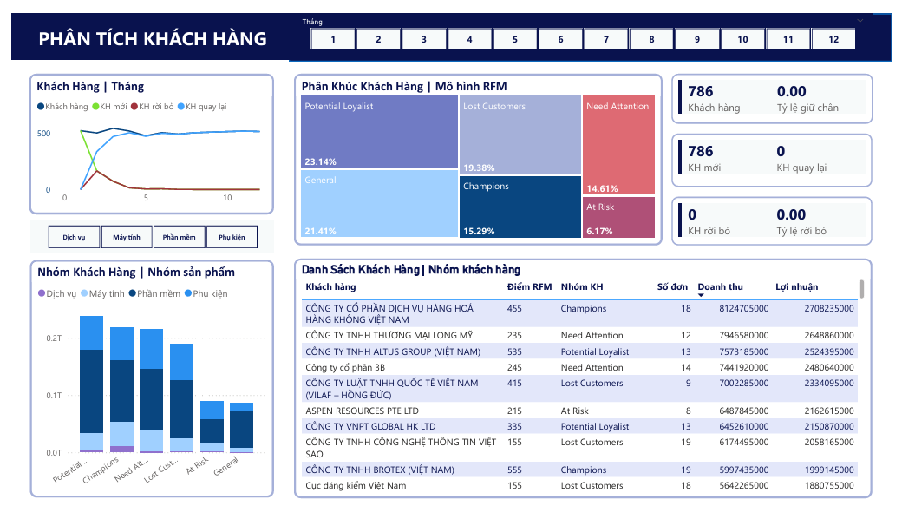
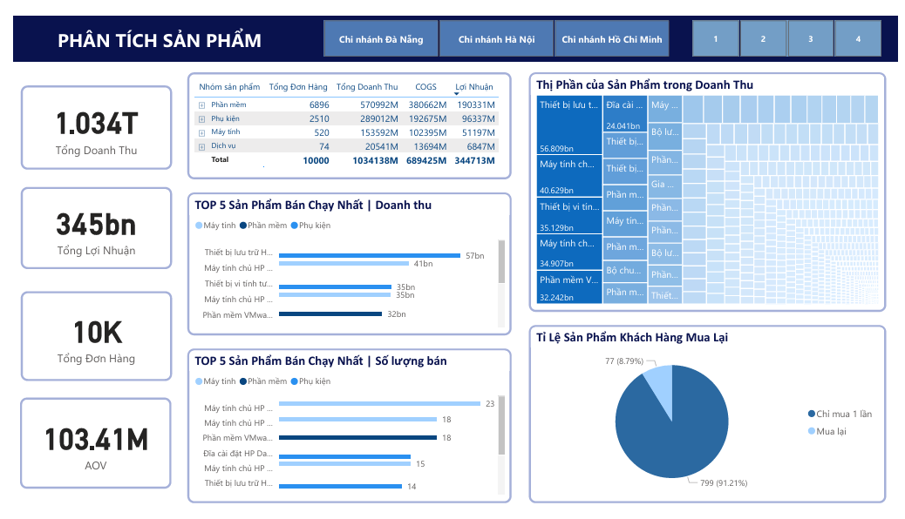
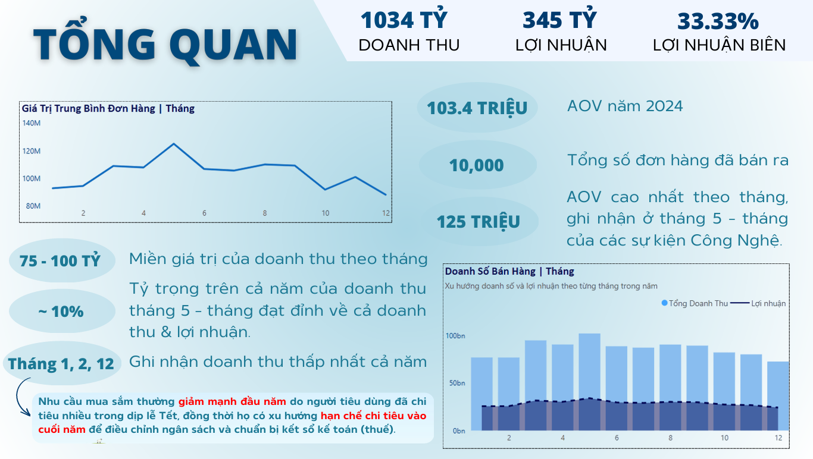

# Data Explorers 2024 – TADA Team Submission

Dự án này được thực hiện bởi nhóm **TADA** trong khuôn khổ cuộc thi **Data Explorers 2024**, với mục tiêu phân tích và đề xuất chiến lược dựa trên bộ dữ liệu thực tế.  
Chúng tôi đã sử dụng kỹ thuật phân tích dữ liệu, trực quan hóa, và storytelling để trình bày giải pháp một cách rõ ràng và thuyết phục.

## Thông tin cuộc thi

- **Tên cuộc thi:** Data Explorers 2024
- **Mục tiêu đề bài:** Phân tích trực quan dữ liệu đã cho và kể lại câu chuyện kinh doanh của công ty, từ đó đưa ra những đề xuất phát triển đột phá cho năm tới

## Thành tích

Dự án này được thực hiện trong khuôn khổ cuộc thi **Data Explorers 2024**.  
Nhóm chúng tôi đạt **Top 2 vòng 1** với phần trình bày insight và trực quan hóa dữ liệu kinh doanh bằng Power BI.

## Thành phần chính trong dự án

| Tên tệp | Mô tả |
|--------|-------|
| `TADA_Report.pdf` | Báo cáo chính thức của nhóm trình bày toàn bộ quy trình phân tích và giải pháp |
| `DATAEXPLORERS_TADA_DASHBOARD.pbix` | Dashboard trình bày cho vòng thi chính thức |
| `TADA_Report.pdf` | Bản PDF bài báo cáo của nhóm |

## Dashboard Preview

> Dưới đây là một số hình ảnh của dashboard
> 

  
  

## Report Preview

> Dưới đây là một số hình ảnh của report
> 

  

## Kỹ năng & Công cụ sử dụng

- Data modelling phù hợp với logic bài toán bằng Power BI
- Viết công thức tính toán nâng cao bằng **DAX** trong Power BI
- Trực quan hóa dữ liệu bằng Power BI: biểu đồ, KPI, drill-down, filter
- Phân tích hành vi người dùng từ dữ liệu thô và đề bài cuộc thi
- Khai thác insight và data storytelling
- Công cụ chính: **Power BI, Excel, Python**

## Ghi chú

Đây là sản phẩm nhóm trong khuôn khổ một cuộc thi học thuật.  
Toàn bộ nội dung phản ánh nỗ lực hợp tác và học tập của các thành viên nhóm.

> **Vui lòng ghi rõ nguồn nếu trích dẫn hoặc sử dụng nội dung từ dự án này.**

## Giới Thiệu Cá Nhân

Dự án góp phần thực hiện bởi *Trần Thị Minh Ngọc* – sinh viên định hướng theo lĩnh vực Phân tích Dữ liệu và Business Intelligence.  
Mong muốn phát triển trong các vai trò liên quan đến phân tích dữ liệu, xây dựng dashboard, và hỗ trợ ra quyết định kinh doanh dựa trên dữ liệu.

📬 Email: [minhngoc04.work@gmai.com]
